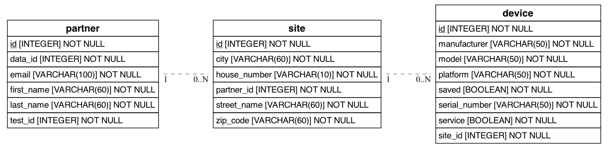

# ConTest-IT

## Alapvető működési elv

* A teszt induláskor egy ún. memória adatbázist indít el, melyben le van képezve az alapvető üzleti igény, az-az egy partnerhez telphelyek, telephelyekhez pedig eszközök rendelhetőek. Ebbe töltődik be az API-tól lekérdezett tesztadat. Ez lehetőséget biztosít arra, hogy a teszt során bármikor, bárhonnan könnyen elérhetőek legyenek a tesztadatok.
* Kódszinten az ORM technológiának köszönhetően egy darab SQL utasítást sem kell kiadni. Az adtbázis táblái, oszlopai és kapcsolatai egy - egy python osztálynak vannak megfeleltetve.
* Teszt indulásakor egy adatbázis migráció történik, ekkor jön létre a memóriában a lentebbi ERD-n is szemléltetett adatbázis szerkezet. Ezt követően ide kerül betöltésre az API-tól lekérdezett tesztadat.
* Python behave tesztek futnak. A tesztekhez cucunber-ben írt mondatok tartoznak, amiket feature fájlokban kell megírni. Minden egyes mondat mögött egy python függvény található, ami a mondatnak megfelelően végrehajtja a tesztesetet vagy az ahhoz tartozó egyéb lépést. 
* A tesztek Google Chrome böngészőben futnak.



## Tesztek futtatása

```shell
    behave path/to/featurefile
```

### Tesztek futtatása dockerben

#### Image elkészítése

```shell
    ./docker-build.ps1
```

#### Teszt futtatása docker konténerben

```shell
    ./run-test.ps1 path/to/featurefile
```

### Dashbord

A tesztek futáskor allure kompatibilis json reportot állítanak elő. Ezek a fájlok egy un. docker volume-ba kerülnek, amiket fel tud olvasni egy másik konténer, ami egy weboldalt tud megjeleníteni, rajta a teszt futások eredményével.

#### Dashboard image készítés

```shell
    ./build-report-server.ps1
```

#### Dashboard indítása

```shell
    ./start-report-server.ps1
```
Ha sikeresen elindult, akkor a következő URL-en érhető el a böngészőből: http://localhost:9999

### Fontosabb beállítások

A "tesztkörnyezet" beállításait egy `.env` nevű fájlban tudjuk megadni.

#### Headless mód engedélyezése

Fontos, hogy ha docker konténerben szeretnénk futtatni a teszteket, akkor engedélyezni kell a headless módot. Ekkor a behave headless-ben fog futni. A beállítás 1 vagy 0 értéket veheti fel.

`RUN_HEADLESS=1`

#### Tesztlépések közötti várakozás

Egyes tesztlépések között adott ideig tudunk várakozni. Így tulajdonképpen lassítható a teszt futása.

`IMPLICIT_WAIT_AFTER_STEPS=1`
